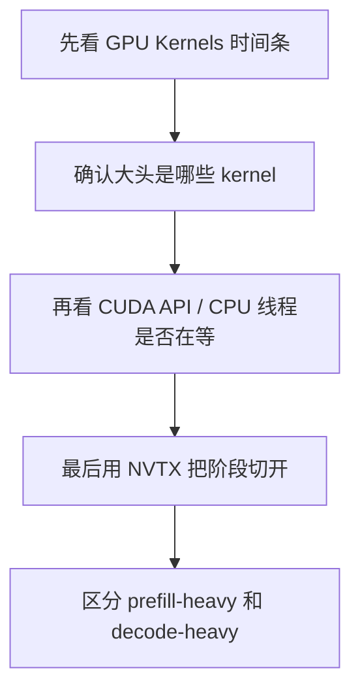
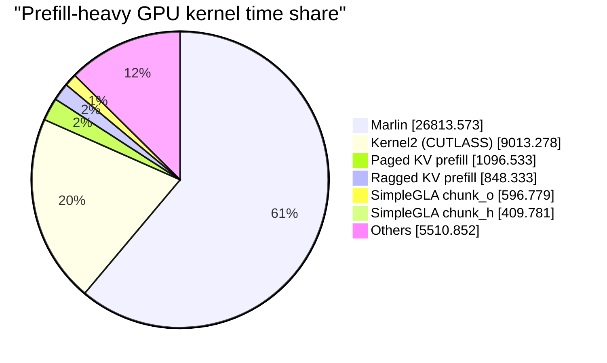
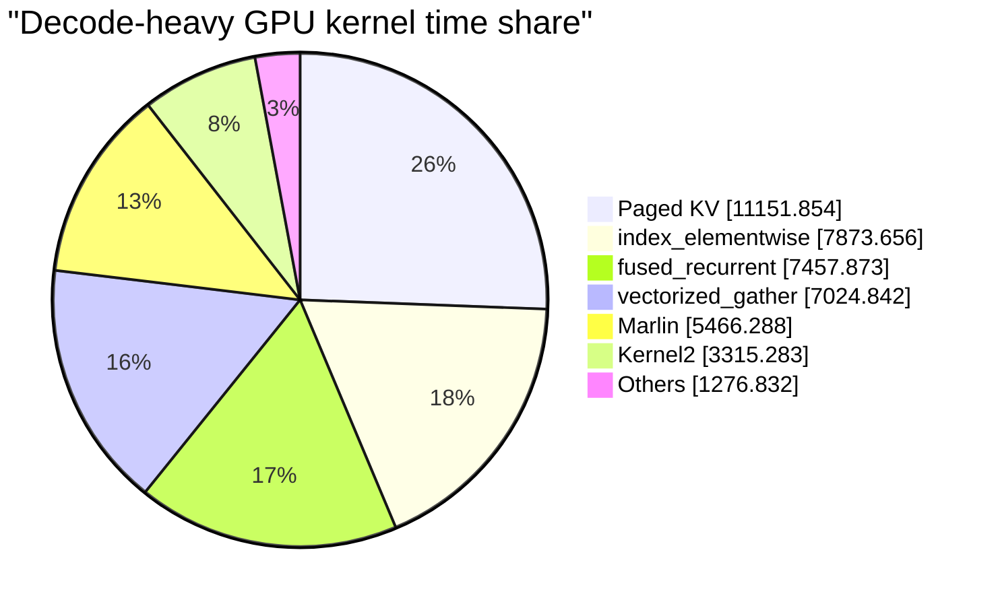
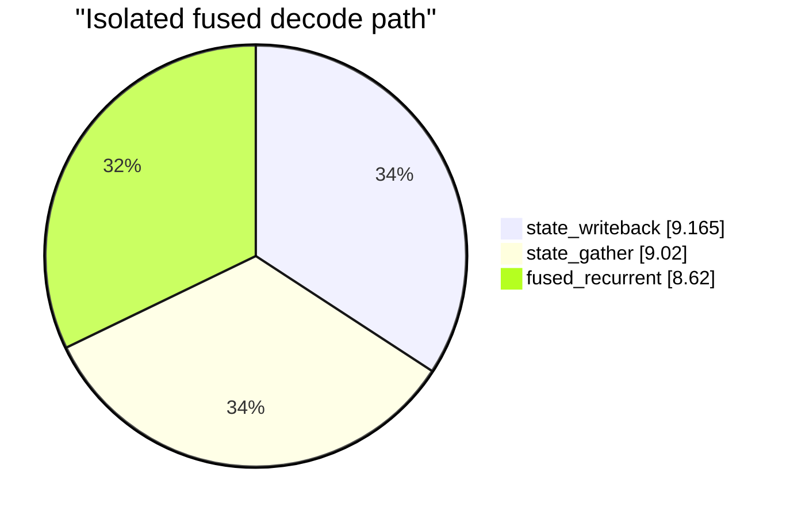
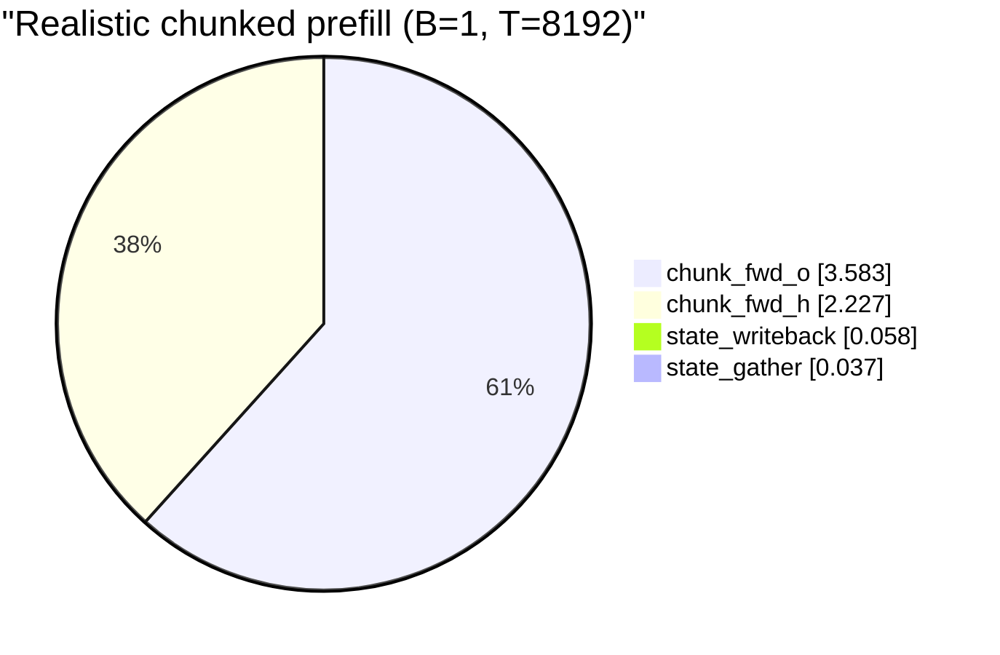
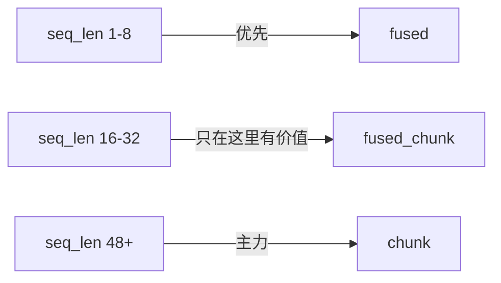
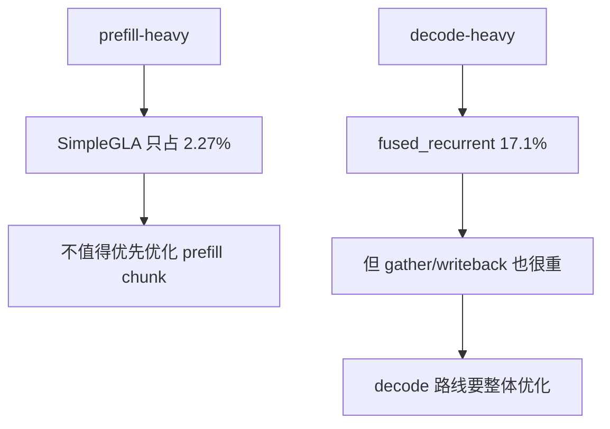

# MiniCPM `SimpleGLA` 后端 Nsight 分析报告（2026-04-20）

## 范围

本报告只讨论 MiniCPM-SALA hybrid 里的 `lightning-attn -> SimpleGLAAttnBackend` 这条线。

统一口径：

- 权重：
  `/root/autodl-tmp/models-gptq-w4a16-py310-attnqkv-allowlist-v1-gate0-fixorder`
- SGLang tree：
  `linear-baseline`
- serve args：
  - `flashinfer`
  - `--force-dense-minicpm`
  - `--chunked-prefill-size 8192`
  - `--disable-radix-cache`
  - `--disable-cuda-graph`
  - `--cuda-graph-max-bs 1`
- extreme workload：
  - `random-ids`
  - `256 prompts`
  - `input_len=32768`
  - `output_len=2048`
  - `max_concurrency=256`

---

## 一眼结论

1. **prefill-heavy 段里，`SimpleGLA` 不是主瓶颈。**
2. **decode-heavy 段里，`SimpleGLA` 变得重要，但也不是单独一个 kernel 的问题。**
3. **如果继续优化 linear backend，优先级应放在 decode 路线，并把 state gather/writeback 和 kernel 本体一起看。**
4. **这台机器当前没有可用 `ncu` counters，所以现在最可信的是 `nsys + NVTX`。**

---

## 怎么看 `nsys` 图

## 1. Timeline 先看什么

打开 `.nsys-rep` 后，优先看三层：

1. CPU/Python 线程
2. CUDA API
3. GPU Kernels

如果有 NVTX，再多看一层：

4. NVTX ranges

判断顺序建议是：



## 2. 我现在看 `nsys` 图时的判据

- 如果 GPU kernel 时间几乎都被 `Marlin / flashinfer` 吃掉，说明 linear backend 不是主角
- 如果 decode 段里 `fused_recurrent_fwd_kernel`、`vectorized_gather_kernel`、`index_elementwise_kernel` 同时很大，说明不是“只优化一个 Triton kernel”就能解
- 如果 isolated case 里 NVTX 显示 `state_gather/state_writeback` 接近 kernel 本体，那 wrapper/state IO 也在账上

---

## 一、prefill-heavy：`SimpleGLA` 只占小头

结果目录：

- `/root/autodl-tmp/SOAR-Toolkit/test_results/nsys_extreme_attnqkv-gate0-nsys-prefill_20260420_120743`

总 GPU kernel 时间：

- `44,288.129 ms`

关键 kernel：

| Kernel | Time (ms) | Share |
|---|---:|---:|
| `Marlin` | `26,813.573` | `60.5%` |
| `Kernel2` (CUTLASS) | `9,013.278` | `20.4%` |
| `BatchPrefillWithPagedKVCacheKernel` | `1,096.533` | `2.5%` |
| `BatchPrefillWithRaggedKVCacheKernel` | `848.333` | `1.9%` |
| `chunk_fwd_kernel_o` | `596.779` | `1.35%` |
| `chunk_fwd_kernel_h` | `409.781` | `0.93%` |
| `SimpleGLA chunk total` | `1,006.560` | `2.27%` |



### 怎么看

- 这张图最重要的不是 `SimpleGLA` 绝对值，而是它和大头相比太小了
- `SimpleGLA chunk` 两个 kernel 加起来只有 `2.27%`
- 所以 **prefill 侧继续抠 linear backend，不会带来成比例的端到端收益**

### 当前判断

- prefill 主瓶颈仍然在：
  - weight matmul (`Marlin`)
  - full-attn/paged-kv prefill
- **不要把 prefill-side chunk 当成当前第一优化目标**

---

## 二、decode-heavy：`SimpleGLA` 开始变重

结果目录：

- `/root/autodl-tmp/SOAR-Toolkit/test_results/nsys_extreme_attnqkv-gate0-nsys-decode_20260420_121605`

总 GPU kernel 时间：

- `43,565.628 ms`

关键 kernel：

| Kernel | Time (ms) | Share |
|---|---:|---:|
| `BatchPrefillWithPagedKVCacheKernel` | `11,151.854` | `25.6%` |
| `index_elementwise_kernel` | `7,873.656` | `18.1%` |
| `fused_recurrent_fwd_kernel` | `7,457.873` | `17.1%` |
| `vectorized_gather_kernel` | `7,024.842` | `16.1%` |
| `Marlin` | `5,466.288` | `12.5%` |
| `Kernel2` (CUTLASS) | `3,315.283` | `7.6%` |



### 怎么看

- `fused_recurrent_fwd_kernel` 单独已经到 `17.1%`
- 但它左右两边还有两个体量非常接近的邻居：
  - `vectorized_gather_kernel`
  - `index_elementwise_kernel`

这张图传达的核心不是：

> `SimpleGLA` kernel 特别慢

而是：

> decode 下，**取 state -> 算 recurrent -> 写回 state** 整个链条都在变重

### 当前判断

- 如果继续优化 linear backend，方向应该是 **decode path 整体**
- 不能只盯 `fused_recurrent_fwd_kernel`

---

## 三、isolated `fused`：decode 路线其实是“三件事差不多重”

结果目录：

- `/root/autodl-tmp/SOAR-Toolkit/test_results/nsys_simple_gla_fusedio_20260420_122753`

形状：

- `variant=fused`
- `batch=128`
- `seq_len=1`
- `include_state_io=true`

关键 kernel：

| Stage | GPU time (ms, total) | Relative share |
|---|---:|---:|
| `index_elementwise_kernel` (`state_writeback`) | `9.165` | `34.2%` |
| `vectorized_gather_kernel` (`state_gather`) | `9.020` | `33.6%` |
| `fused_recurrent_fwd_kernel` | `8.620` | `32.2%` |



### 怎么看

- 这张图非常关键
- 它说明 decode 路线不是“kernel 本体压倒一切”
- 在当前 shape 下，**gather / recurrent / writeback 三者几乎三分天下**

### 当前判断

- 单改 `fused_recurrent` kernel，本身收益上限有限
- 如果未来要做 decode 优化，应优先考虑：
  - state 布局
  - state 访问方式
  - recurrent kernel + state IO 联合优化

---

## 四、isolated `chunk`：prefill 真实形状下应该先盯 `o`

### A. 中等序列、批量较大

结果目录：

- `/root/autodl-tmp/SOAR-Toolkit/test_results/nsys_simple_gla_chunkio_20260420_122832`

形状：

- `variant=chunk`
- `batch=128`
- `seq_len=64`
- `include_state_io=true`

关键 kernel：

| Stage | GPU time (ms, total) | Relative share |
|---|---:|---:|
| `chunk_fwd_kernel_h` | `13.866` | `36.2%` |
| `state_gather` | `8.846` | `23.1%` |
| `state_writeback` | `8.350` | `21.8%` |
| `chunk_fwd_kernel_o` | `7.218` | `18.9%` |

这个 case 更像“batched 中间区间”。

### B. 真实 `8192` prefill chunk

结果目录：

- `/root/autodl-tmp/SOAR-Toolkit/test_results/nsys_simple_gla_chunkio_b1t8192_20260420_123053`

形状：

- `variant=chunk`
- `batch=1`
- `seq_len=8192`
- `include_state_io=true`

关键 kernel：

| Stage | GPU time (ms, total) | Relative share |
|---|---:|---:|
| `chunk_fwd_kernel_o` | `3.583` | `60.7%` |
| `chunk_fwd_kernel_h` | `2.227` | `37.7%` |
| `state_writeback` | `0.058` | `1.0%` |
| `state_gather` | `0.037` | `0.6%` |



### 怎么看

- 如果只看 `B=128,T=64`，会误以为 `h` 最该优先优化
- 但贴近我们真实 serve 的 `B=1,T=8192` 后，`o` 明显更重
- 同时 state IO 几乎可以忽略

### 当前判断

- 如果未来真的要优化 prefill-side `chunk`
- **优先看 `chunk_fwd_kernel_o`**
- 不要被中间 shape 的 microbench 误导

---

## 五、`fused / fused_chunk / chunk` 的切换区间

结果文件：

- `/root/autodl-tmp/SOAR-Toolkit/test_results/simple_gla_threshold_b128_20260420_122557.json`

设置：

- `batch=128`
- `seq_pattern=uniform`
- `index_pattern=random`

关键结论：

| Seq len | 最优 variant | 说明 |
|---:|---|---|
| `1-8` | `fused` | 短 decode 最强 |
| `16-32` | `fused_chunk` | 只在窄区间赢 |
| `48+` | `chunk` | 长一点后 `chunk` 更稳 |

几个代表点：

| Seq len | fused | fused_chunk | chunk |
|---:|---:|---:|---:|
| `1` | `1.094 ms` | `1.124 ms` | `1.338 ms` |
| `16` | `1.372 ms` | `1.267 ms` | `1.407 ms` |
| `32` | `1.781 ms` | `1.426 ms` | `1.469 ms` |
| `48` | `2.021 ms` | `1.614 ms` | `1.536 ms` |
| `64` | `2.301 ms` | `1.817 ms` | `1.599 ms` |
| `128` | `3.565 ms` | `2.575 ms` | `2.057 ms` |



### 怎么看

- `fused_chunk` 不是通用替代品
- 它只在一个很窄的中间区间赢
- 所以现在不适合把它直接升成全局默认

---

## 六、为什么这次还没有 `ncu` 图

当前机器上，`ncu` 统一报错：

```text
==ERROR== ERR_NVGPUCTRPERM
```

所以现在**没有可靠的 `ncu` occupancy/stall 图**。  
这不是 case 代码有 bug，而是 host/container 权限没给 GPU performance counters。

---

## 七、如果以后 `ncu` 打开了，要怎么看

## 1. 先看这四类图

1. Occupancy
2. Warp Stall
3. Memory Workload Analysis
4. Scheduler / Launch Stats

## 2. 我会怎么判断

### 如果看到：

- occupancy 低
- register pressure 高

说明：

- kernel 可能被寄存器数限制
- 可以考虑调 tile / `num_warps` / `num_stages`

### 如果看到：

- DRAM/L2 throughput 很高
- warp stall 主要是 memory throttle / long scoreboard

说明：

- 更像带宽瓶颈
- 优先看访存模式、state 布局、gather/scatter

### 如果看到：

- warp stall 主要是 execution dependency

说明：

- 更像计算/流水线问题
- 可以考虑 kernel 分块、流水、算子融合

---

## 八、现阶段的最终判断



### 现在最值得相信的工程结论

1. **`SimpleGLA` 不是当前 prefill 的第一瓶颈。**
2. **`SimpleGLA` 在 decode 段是重要热点，但问题是“kernel + state IO”联合瓶颈。**
3. **`fused_chunk` 只在窄区间有用，不适合直接全局替换。**
4. **如果没有 host 级 `ncu` counters，继续深挖 kernel 参数会越来越像盲调。**

---

## 当前建议

### 如果只做一件事

去 host 侧打开 GPU performance counters。

### 在那之前

- 不要继续猛改 prefill-side `chunk`
- 如果要继续碰 linear backend，优先盯 decode：
  - `fused_recurrent`
  - `state_gather`
  - `state_writeback`

---

## 相关结果目录

- prefill-heavy:
  `/root/autodl-tmp/SOAR-Toolkit/test_results/nsys_extreme_attnqkv-gate0-nsys-prefill_20260420_120743`
- decode-heavy:
  `/root/autodl-tmp/SOAR-Toolkit/test_results/nsys_extreme_attnqkv-gate0-nsys-decode_20260420_121605`
- isolated fused + state io:
  `/root/autodl-tmp/SOAR-Toolkit/test_results/nsys_simple_gla_fusedio_20260420_122753`
- isolated chunk + state io:
  `/root/autodl-tmp/SOAR-Toolkit/test_results/nsys_simple_gla_chunkio_20260420_122832`
- isolated chunk realistic `8192`:
  `/root/autodl-tmp/SOAR-Toolkit/test_results/nsys_simple_gla_chunkio_b1t8192_20260420_123053`
- `ncu` 权限失败样例:
  `/root/autodl-tmp/SOAR-Toolkit/test_results/ncu_simple_gla_chunk_20260420_122701`
